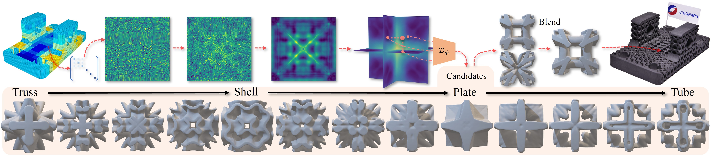

# MIND: Microstructure INverse Design with Generative Hybrid Neural Representation

[](https://arxiv.org/abs/2502.02607)

Official code and instructions for the paper:  
**MIND: Microstructure INverse Design with Generative Hybrid Neural Representation**  
By Tianyang Xue, Haochen Li, Longdu Liu, Paul Henderson, Pengbin Tang, Lin Lu, Jikai Liu, Haisen Zhao, Hao Peng, Bernd Bickel



---

## Overview

This repository provides tools for generating microstructural holoplane representations and training a diffusion model to generate new physically plausible designs.

---


## Step 1: Generate Holoplnaes

Run the provided shell script:

```bash
bash save_tri.sh
```

> 🔧 **Note:** In `save_tri.py`, make sure to choose the correct function for `save_triplane_latents`:
>
> - If your symmetry is **1/48**, use: `sym_corner`
> - If your symmetry is **1/8**, use: `now_tri_corner`


## Step 2: Train the Diffusion Model

Navigate to:

```bash
cd edm
```

## Citation

If you use this work, please cite:

```bibtex
@misc{xue2025mindmicrostructureinversedesign,
      title={MIND: Microstructure INverse Design with Generative Hybrid Neural Representation}, 
      author={Tianyang Xue and Haochen Li and Longdu Liu and Paul Henderson and Pengbin Tang and Lin Lu and Jikai Liu and Haisen Zhao and Hao Peng and Bernd Bickel},
      year={2025},
      eprint={2502.02607},
      archivePrefix={arXiv},
      primaryClass={cs.CV},
      url={https://arxiv.org/abs/2502.02607}, 
}
```
