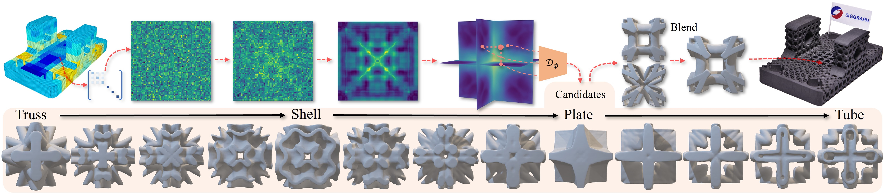

# MIND: Microstructure INverse Design with Generative Hybrid Neural Representation

[](https://arxiv.org/abs/2502.02607)

Official code for **MIND: Microstructure INverse Design with Generative Hybrid Neural Representation**.

Tianyang Xue, Longdu Liu, Lin Lu, Paul Henderson, Pengbin Tang, Haochen Li, Jikai Liu, Haisen Zhao, Hao Peng, Bernd Bickel



## Setup

Use Linux with Python 3.11 or 3.12. From the repository directory:

```bash
bash setup.sh              # creates .venv and selects CUDA when available
# bash setup.sh --cpu      # CPU installation
```

Setup installs dependencies and prepares the two included examples. Request the checkpoints from [TimHsue@gmail.com](mailto:TimHsue@gmail.com) and place them here:

```text
checkpoints/mind_diffusion.pkl
checkpoints/mind_autoencoder.pt
```

Only load trusted checkpoints.

## Demos

**Decode an existing holoplane into an OBJ mesh:**

```bash
bash scripts/demo.sh holoplane
bash scripts/demo.sh holoplane --latent your_holoplane.npy
```

This needs only `mind_autoencoder.pt`. Outputs are saved in `outputs/holoplane_demo/`: `field.npy`, `mesh.obj`, `result.json` and `preview.png`.

**Generate a holoplane from physical conditions, then decode it into OBJ:**

```bash
bash scripts/demo.sh diffusion --count 1 --raw-C 0.09,0.02,0.02
```

This needs both weights. Conditions are physical `[C11,C12,C44]`, with material E=1 and nu=0.35. Outputs are saved in `outputs/default_demo/`: generated holoplanes, a decoded SDF and OBJ for each candidate, and one preview of the first candidate.

The default pair is MIND diffusion with its paired holoplane autoencoder, using **32 steps, CFG 7 and batch size 4**. The remaining settings are in `scripts/default.json`. Both demos select CUDA when available; use `--device cpu` if needed. For diffusion, `--batch-size 1` reduces memory use. Calling `scripts/demo.sh` without a mode runs diffusion. Use `bash scripts/demo.sh <mode> --help` for options. See [previews](docs/DEMOS.md).

**SDF extent:** the full grid covers `[-1,1]³`. The microstructure cell occupies the central approximately **80% of each axis**, `[-0.8,0.8]³`, with approximately 10% padding on each side. This describes linear extent, not solid volume fraction. Preserve the padding when preparing voxel SDF inputs. SDF values are negative inside and positive outside; the mesh is the zero-level surface.

## Data and training

Two small synthetic examples are included (about 12.6 MB combined). Setup extracts them into `data/`, preserving an existing nonempty data directory. These generated examples support demos and diffusion smoke training; displacement references are not included. See [data formats and coordinate conventions](docs/DATA_FORMAT.md).

For the full dataset and checkpoints, contact [TimHsue@gmail.com](mailto:TimHsue@gmail.com).

Check the installation and run one small CPU training step. Installation checks use temporary copies of the bundled examples and preserve your dataset:

```bash
bash scripts/test.sh
bash scripts/test.sh --with-model   # also load both weights and decode an example
bash scripts/train.sh --smoke
```

### Diffusion training

Prepare your diffusion dataset under `data/` following the specification, then run:

```bash
bash scripts/train.sh --batch 4 --batch-gpu 1
# Initialize from released weights:
bash scripts/train.sh --batch 4 --batch-gpu 1 --resume checkpoints/mind_diffusion.pkl
```

The smoke run uses a small network. Ordinary training uses `MINDDenoiser` with its `MINDUNet` backbone; keep batch size divisible by the per-device batch size and device count. Training applies v3 condition normalization `[1.2*C11,3*(C12+0.01),5*C44]` once for physical labels. For full training, prepare your dataset and use CUDA GPUs.

### Autoencoder training

The joint AE trainer learns the voxel encoder, SDF decoder and displacement/property decoder. It requires CUDA and compatible voxel SDF, SDF point samples, displacement references and physical `[C11,C12,C44]` conditions.

Prepare `data/voxel/`, `data/points/` and `data/displacement/` with matching sample names. AE split files (`ae_train.txt`, `ae_val.txt`) must contain one sample basename per line **without `.npy`**; use disjoint training and validation splits. Property JSON files (`ae_train_conditions.json`, `ae_val_conditions.json`) contain a `labels` dictionary keyed by filenames **with `.npy`**, storing physical conditions before diffusion normalization. See [the AE data specification](docs/DATA_FORMAT.md#joint-autoencoder-training).

```bash
NPROC_PER_NODE=1 bash scripts/train_holoplane.sh \
  --dataset_voxel data/voxel \
  --dataset_occup data/points \
  --dataset_elastic_tensor data/displacement \
  --dataset_list data/ae_train.txt \
  --dataset_list_vali data/ae_val.txt \
  --dataset_pro data/ae_train_conditions.json \
  --dataset_pro_vali data/ae_val_conditions.json \
  --log_dir outputs/ae_training/logs \
  --checkpoint_path outputs/ae_training/checkpoints \
  --resolution 128 --channels 32 --aggregate_fn sum \
  --batch_size 1 --points_batch_size 8192
```

`NPROC_PER_NODE` sets the GPU count; `--batch_size` is per GPU. The point batch size above is a conservative starting value for memory use; increase it as resources allow. Training visualization also decodes in chunks; `--vis_chunk_size` controls the chunk size and `--vis_every 0` disables it. This command starts joint training from scratch. Add `--load_ckpt_path checkpoints/mind_autoencoder.pt` to initialize from the released weights; for a training checkpoint, the optimizer state and epoch are restored, and `--epochs` specifies the total target epoch count.

Additional entry points use the same `.venv`:

| Task | Entry point |
|---|---|
| Distributed diffusion training | `NPROC_PER_NODE=4 bash scripts/train_diffusion.sh --help` |
| Joint autoencoder training | `bash scripts/train_holoplane.sh --help` |
| Batch voxel SDF → holoplane export | `bash scripts/export_holoplanes.sh --help` |
| Physical evaluation of a prepared periodic cell | `.venv/bin/python scripts/evaluate_cell.py --help` |

For CUDA physical evaluation, install the optional backend with `.venv/bin/python -m pip install -r scripts/requirements-gpu-physics.txt`.

## Repository layout

```text
src/mind_diffusion/    diffusion models, sampling and training
src/mind_holoplane/    encoder, SDF decoder, joint training and physics
scripts/              launchers, default settings, dependencies and checks
assets/               images and two small format examples
docs/                 data specification and demo previews
checkpoints/          place downloaded weights here
```

## License

Code, released weights and examples use **CC BY-NC-SA 4.0**. See [LICENSE.txt](LICENSE.txt).

## Citation

If you use this work, please cite:

```bibtex
@inproceedings{10.1145/3721238.3730682,
author = {Xue, Tianyang and Liu, Longdu and Lu, Lin and Henderson, Paul and Tang, Pengbin and Li, Haochen and Liu, Jikai and Zhao, Haisen and Peng, Hao and Bickel, Bernd},
title = {MIND: Microstructure INverse Design with Generative Hybrid Neural Representation},
year = {2025},
isbn = {9798400715402},
publisher = {Association for Computing Machinery},
address = {New York, NY, USA},
url = {https://doi.org/10.1145/3721238.3730682},
doi = {10.1145/3721238.3730682},
booktitle = {Proceedings of the Special Interest Group on Computer Graphics and Interactive Techniques Conference Conference Papers},
series = {SIGGRAPH Conference Papers '25}
}
```
