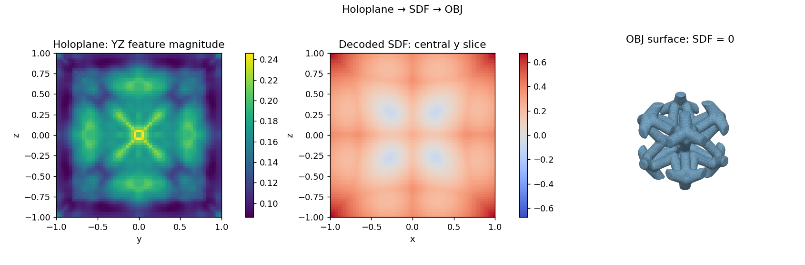
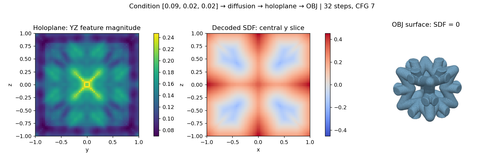

# Features and previews

Run `bash setup.sh` and place the weights in `checkpoints/`. Each of the two inference demos writes one `preview.png` alongside its numeric outputs.

| Inference feature | Command | Required weights | Saved outputs |
|---|---|---|---|
| Existing holoplane → SDF → OBJ | `bash scripts/demo.sh holoplane` | Autoencoder | SDF, OBJ, preview |
| Physical condition → diffusion → holoplane → SDF → OBJ | `bash scripts/demo.sh diffusion --count 1 --raw-C 0.09,0.02,0.02` | Diffusion + autoencoder | Holoplane, SDF, OBJ, preview; default 32 steps, CFG 7 |

## Holoplane decoding

For an existing array, add `--latent your_holoplane.npy`. The preview shows one holoplane feature magnitude, a decoded SDF slice and the zero-level surface.

## Conditional diffusion

Supply physical `[C11,C12,C44]` with `--raw-C`. The preview shows the first candidate; `--count` controls how many candidates are generated and decoded. All candidates' numeric outputs and meshes are saved.

## Training and supporting tools

| Tool | Entry point | Required inputs |
|---|---|---|
| Diffusion training and resume | `scripts/train.sh`; `scripts/train_diffusion.sh` for distributed launch | Holoplanes, conditions and split files |
| Joint autoencoder training | `scripts/train_holoplane.sh` | Voxel SDF, SDF points, displacement references, conditions and split files; CUDA |
| Voxel SDF → holoplane export | `scripts/export_holoplanes.sh` | Voxel SDF, physical conditions and autoencoder weights |
| Physical evaluation | `scripts/evaluate_cell.py` | Periodic solid-mask array; optional GPU physics dependencies for CUDA |
| Installation checks | `scripts/test.sh`; add `--with-model` for model checks | Included examples; both checkpoints for model checks |

See [DATA_FORMAT.md](DATA_FORMAT.md) for array shapes, split files and coordinate conventions.
